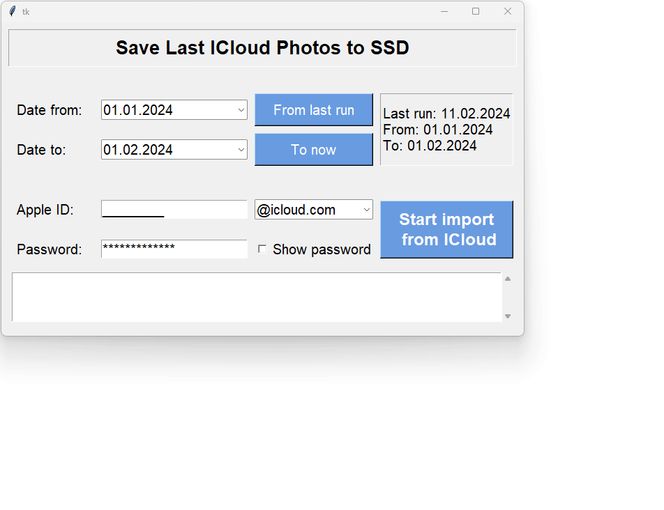

# iCloud Photos Loader
## Overview
This application allows users to download photos from iCloud within a specified time interval. 
Users can input two dates to define the range, and provide their iCloud credentials for authentication. 
The app connects to the iCloud API using the [pyiCloud package](https://github.com/picklepete/pyicloud), retrieves the photos taken between the specified dates, and saves them as a zip archive on the user's computer.

## Installation
1. Clone the repository
```bash
git clone https://github.com/MykytaLein/icloud-sync.git
```
2. Install the required packages
```bash
pip install -r requirements.txt
```
3. Start the main.py file
```bash
python main.py
```

## Usage
1. Enter the start and end dates to define the time interval for downloading photos.
2. Input your iCloud credentials and push the start button.
3. If requested complete two factor or two step verification.
4. The app will connect to the iCloud API, retrieve the photos within the specified dates, and save them as a zip archive in the current working directory.
5. The process can be stopped at any time by pushing the stop button as the photo processing runs on a different thread.

## Example
